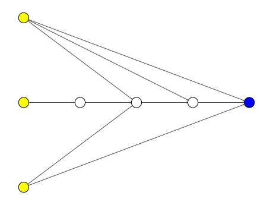

<h1 align="center">
  <a href="https://github.com/EMI-Group/evox">
  <picture>
    <source media="(prefers-color-scheme: dark)" srcset="./imgs/evox_logo_dark.png">
    <source media="(prefers-color-scheme: light)" srcset="./imgs/evox_logo_light.png">
      
  </picture>
  </a>
  <br>
</h1>

<p align="center">
🌟 TensorNEAT: Tensorized NEAT Implementation in JAX 🌟
</p>

<p align="center">
  <a href="https://arxiv.org/abs/2404.01817">
    
  </a>
</p>

## Introduction
TensorNEAT is a JAX-based libaray for NeuroEvolution of Augmenting Topologies (NEAT) algorithms, focused on harnessing GPU acceleration to enhance the efficiency of evolving neural network structures for complex tasks. Its core mechanism involves the tensorization of network topologies, enabling parallel processing and significantly boosting computational speed and scalability by leveraging modern hardware accelerators. TensorNEAT is compatible with the [EvoX](https://github.com/EMI-Group/evox/) framewrok.

## Key Features
- JAX-based network for neuroevolution:
    - **Batch inference** across networks with different architectures, GPU-accelerated.
    - Evolve networks with **irregular structures** and **fully customize** their behavior.
    - Visualize the network and represent it in **mathematical formulas** or codes.

- GPU-accelerated NEAT implementation:
    - Run NEAT and HyperNEAT on GPUs.
    - Achieve **500x** speedup compared to CPU-based NEAT libraries.

- Rich in extended content:
    - Compatible with **EvoX** for multi-device and distributed support.
    - Test neuroevolution algorithms on advanced **RL tasks** (Brax, Gymnax).

## Basic API Usage
Start your journey with TensorNEAT in a few simple steps:

1. **Import necessary modules**:
```python
from tensorneat.pipeline import Pipeline
from tensorneat import algorithm, genome, problem, common
```

2. **Configure the NEAT algorithm and define a problem**:
```python
algorithm = algorithm.NEAT(
    pop_size=10000,
    species_size=20,
    survival_threshold=0.01,
    genome=genome.DefaultGenome(
        num_inputs=3,
        num_outputs=1,
        output_transform=common.ACT.sigmoid,
    ),
)
problem = problem.XOR3d()
```

3. **Initialize the pipeline and run**:
```python
pipeline = Pipeline(
    algorithm,
    problem,
    generation_limit=200,
    fitness_target=-1e-6,
    seed=42,
)
state = pipeline.setup()
# run until termination
state, best = pipeline.auto_run(state)
# show results
pipeline.show(state, best)
```
  Obtain result in a few generations:
```
Fitness limit reached!
input: [0. 0. 0.], target: [0.], predict: [0.00066471]
input: [0. 0. 1.], target: [1.], predict: [0.9992988]
input: [0. 1. 0.], target: [1.], predict: [0.9988666]
input: [0. 1. 1.], target: [0.], predict: [0.00107922]
input: [1. 0. 0.], target: [1.], predict: [0.9987184]
input: [1. 0. 1.], target: [0.], predict: [0.00093677]
input: [1. 1. 0.], target: [0.], predict: [0.00060118]
input: [1. 1. 1.], target: [1.], predict: [0.99927646]
loss: 8.484730074087565e-07
```
4. **Visualize the best network**:
```python
network = algorithm.genome.network_dict(state, *best)
algorithm.genome.visualize(network, save_path="./imgs/xor_network.svg")
```
<div style="text-align: center;">
    
</div>

5. **Transform the network to latex formulas or python codes**:
```python
from tensorneat.common.sympy_tools import to_latex_code, to_python_code

sympy_res = algorithm.genome.sympy_func(
    state, network, sympy_output_transform=ACT.obtain_sympy(ACT.sigmoid)
)
latex_code = to_latex_code(*sympy_res)
print(latex_code)

python_code = to_python_code(*sympy_res)
print(python_code)
```
Obtain latex formulas:
```latex
\begin{align}
h_{0} &= \frac{1}{2.83 e^{5.66 h_{1} - 6.08 h_{2} - 3.03 i_{2}} + 1}\newline
h_{1} &= \frac{1}{0.3 e^{- 4.8 h_{2} + 9.22 i_{0} + 8.09 i_{1} - 10.24 i_{2}} + 1}\newline
h_{2} &= \frac{1}{0.27 e^{4.28 i_{1}} + 1}\newline
o_{0} &= \frac{1}{0.68 e^{- 20.86 h_{0} + 11.12 h_{1} + 14.22 i_{0} - 1.96 i_{2}} + 1}\newline
\end{align}
```
Obtain python codes:
```python
h = np.zeros(3)
o = np.zeros(1)
h[0] = 1/(2.825013*exp(5.660946*h[1] - 6.083459*h[2] - 3.033361*i[2]) + 1)
h[1] = 1/(0.300038*exp(-4.802896*h[2] + 9.215506*i[0] + 8.091845*i[1] - 10.241107*i[2]) + 1)
h[2] = 1/(0.269965*exp(4.279962*i[1]) + 1)
o[0] = 1/(0.679321*exp(-20.860441*h[0] + 11.122242*h[1] + 14.216276*i[0] - 1.961642*i[2]) + 1)
```


## Installation
Install `tensorneat` from the GitHub source code:
```
pip install git+https://github.com/EMI-Group/tensorneat.git
```


## Community & Support

- Engage in discussions and share your experiences on [GitHub Discussion Board](https://github.com/EMI-Group/evox/discussions).
- Join our QQ group (ID: 297969717).
  
## Citing TensorNEAT

If you use TensorNEAT in your research and want to cite it in your work, please use:
```
@article{tensorneat,
  title = {{Tensorized} {NeuroEvolution} of {Augmenting} {Topologies} for {GPU} {Acceleration}},
  author = {Wang, Lishuang and Zhao, Mengfei and Liu, Enyu and Sun, Kebin and Cheng, Ran},
  booktitle = {Proceedings of the Genetic and Evolutionary Computation Conference (GECCO)},
  year = {2024}
}
