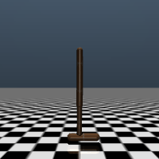
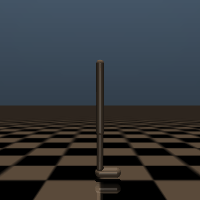
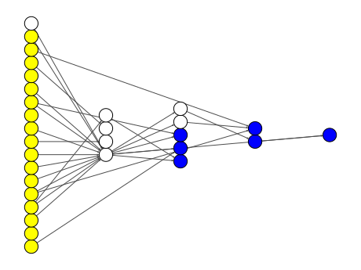
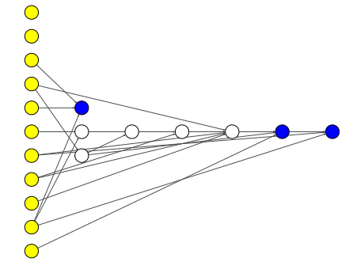
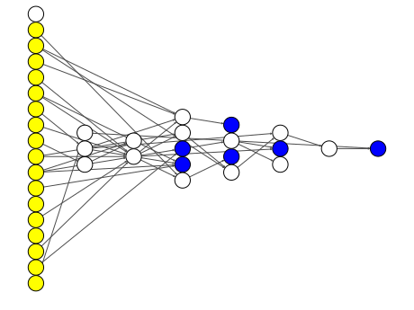

<h1 align="center">
  <a href="https://github.com/EMI-Group/evox">
  <picture>
    <source media="(prefers-color-scheme: dark)" srcset="./imgs/evox_logo_dark.png">
    <source media="(prefers-color-scheme: light)" srcset="./imgs/evox_logo_light.png">
      
  </picture>
  </a>
  <br>
</h1>

<p align="center">
🌟 TensorNEAT: JAX-based NEAT Library for GPU Acceleration 🌟
</p>

<p align="center">
  <a href="https://arxiv.org/abs/2404.01817">
    
  </a>
</p>

## TensorNEAT @ GECCO 2024
TensorNEAT has been selected to recieve the **[GECCO 2024 Best Paper Award](https://gecco-2024.sigevo.org/Best-Paper-Awards)** 🏆

Many thanks to everyone who has been supporting TensorNEAT, and we will remain committed to advancing TensorNEAT for future 'open-endedness'!

## Introduction
TensorNEAT is a JAX-based libaray for NeuroEvolution of Augmenting Topologies (NEAT) algorithms, focused on harnessing GPU acceleration to enhance the efficiency of evolving neural network structures for complex tasks. Its core mechanism involves the tensorization of network topologies, enabling parallel processing and significantly boosting computational speed and scalability by leveraging modern hardware accelerators. TensorNEAT is compatible with the [EvoX](https://github.com/EMI-Group/evox/) framewrok.

## Key Features
- JAX-based network for neuroevolution:
    - **Batch inference** across networks with different architectures, GPU-accelerated.
    - Evolve networks with **irregular structures** and **fully customize** their behavior.
    - Visualize the network and represent it in **mathematical formulas** or **codes**.

- GPU-accelerated NEAT implementation:
    - Run NEAT and HyperNEAT on GPUs.
    - Achieve **500x** speedup compared to CPU-based NEAT libraries.

- Rich in extended content:
    - Compatible with **EvoX** for multi-device and distributed support.
    - Test neuroevolution algorithms on advanced **RL tasks** (Brax, Gymnax).

## Solving RL Tasks
Using the NEAT algorithm to solve RL tasks. Here are some results:

The following animations show the behaviors in Brax environments:

|  |  |  |
|:-----------------------------------------------------------------------------:|:--------------------------------------------------------------------:|:------------------------------------------------------------------------:|
| halfcheetah                                                                   | hopper                                                               | walker2d                                                                 |

The following graphs show the network of the control policy generated by the NEAT algorithm:

|  |  |  |
|:-----------------------------------------------------------------------------:|:--------------------------------------------------------------------:|:------------------------------------------------------------------------:|
| halfcheetah                                                                   | hopper                                                               | walker2d                                                                 |

You can use these codes for running an RL task (Brax Hopper) in TensorNEAT:
```python
# Import necessary modules
from tensorneat.pipeline import Pipeline
from tensorneat.algorithm.neat import NEAT
from tensorneat.genome import DefaultGenome, BiasNode
from tensorneat.problem.rl import BraxEnv
from tensorneat.common import ACT, AGG

# Define the pipeline
pipeline = Pipeline(
    algorithm=NEAT(
        pop_size=1000,
        species_size=20,
        survival_threshold=0.1,
        compatibility_threshold=1.0,
        genome=DefaultGenome(
            num_inputs=11,
            num_outputs=3,
            init_hidden_layers=(),
            node_gene=BiasNode(
                activation_options=ACT.tanh,
                aggregation_options=AGG.sum,
            ),
            output_transform=ACT.tanh,
        ),
    ),
    problem=BraxEnv(
        env_name="hopper",
        max_step=1000,
    ),
    seed=42,
    generation_limit=100,
    fitness_target=5000,
)

# Initialize state
state = pipeline.setup()

# Run until termination
state, best = pipeline.auto_run(state)
```
More examples of RL tasks in TensorNEAT can be found in `./examples/brax` and `./examples/gymnax`.

## Solving Function Fitting Tasks (Symbolic Regression)
You can define your custom function and use the NEAT algorithm to solve the function fitting task.

1. Import necessary modules:
```python
import jax, jax.numpy as jnp
from tensorneat.pipeline import Pipeline
from tensorneat.algorithm.neat import NEAT
from tensorneat.genome import DefaultGenome, BiasNode
from tensorneat.problem.func_fit import CustomFuncFit
from tensorneat.common import ACT, AGG
```

2. Define a custom function to be fit, and then create the function fitting problem:
```python
def pagie_polynomial(inputs):
    x, y = inputs
    res = 1 / (1 + jnp.pow(x, -4)) + 1 / (1 + jnp.pow(y, -4))

    # Important! Returns an array with one item, NOT a scalar
    return jnp.array([res])

custom_problem = CustomFuncFit(
    func=pagie_polynomial,
    low_bounds=[-1, -1],
    upper_bounds=[1, 1],
    method="sample",
    num_samples=100,
)
```

3. Define custom activation function for the NEAT algorithm:
```python
def square(x):
    return x ** 2
ACT.add_func("square", square)
```

4. Define the NEAT algorithm:
```python
algorithm = NEAT(
    pop_size=10000,
    species_size=20,
    survival_threshold=0.01,
    genome=DefaultGenome(
        num_inputs=2,
        num_outputs=1,
        init_hidden_layers=(),
        node_gene=BiasNode(
            # Using (identity, inversion, square) 
            # as possible activation functions
            activation_options=[ACT.identity, ACT.inv, ACT.square],
            # Using (sum, product) as possible aggregation functions
            aggregation_options=[AGG.sum, AGG.product],
        ),
        output_transform=ACT.identity,
    ),
)
```

5. Define the Pipeline and then run it:
```python
pipeline = Pipeline(
    algorithm=algorithm,
    problem=custom_problem,
    generation_limit=50,
    fitness_target=-1e-4,
    seed=42,
)

# Initialize state
state = pipeline.setup()
# Run until termination
state, best = pipeline.auto_run(state)
# Show result
pipeline.show(state, best)
```
More examples of function fitting tasks in TensorNEAT can be found in `./examples/func_fit`.

## Basic API Usage
Start your journey with TensorNEAT in a few simple steps:

1. **Import necessary modules**:
```python
from tensorneat.pipeline import Pipeline
from tensorneat import algorithm, genome, problem, common
```

2. **Configure the NEAT algorithm and define a problem**:
```python
algorithm = algorithm.NEAT(
    pop_size=10000,
    species_size=20,
    survival_threshold=0.01,
    genome=genome.DefaultGenome(
        num_inputs=3,
        num_outputs=1,
        output_transform=common.ACT.sigmoid,
    ),
)
problem = problem.XOR3d()
```

3. **Initialize the pipeline and run**:
```python
pipeline = Pipeline(
    algorithm,
    problem,
    generation_limit=200,
    fitness_target=-1e-6,
    seed=42,
)
state = pipeline.setup()
# run until termination
state, best = pipeline.auto_run(state)
# show results
pipeline.show(state, best)
```
  Obtain result in a few generations:
```
Fitness limit reached!
input: [0. 0. 0.], target: [0.], predict: [0.00037953]
input: [0. 0. 1.], target: [1.], predict: [0.9990619]
input: [0. 1. 0.], target: [1.], predict: [0.9991497]
input: [0. 1. 1.], target: [0.], predict: [0.0004661]
input: [1. 0. 0.], target: [1.], predict: [0.998262]
input: [1. 0. 1.], target: [0.], predict: [0.00077246]
input: [1. 1. 0.], target: [0.], predict: [0.00082464]
input: [1. 1. 1.], target: [1.], predict: [0.99909043]
loss: 8.861396736392635e-07
```
4. **Visualize the best network**:
```python
network = algorithm.genome.network_dict(state, *best)
algorithm.genome.visualize(network, save_path="./imgs/xor_network.svg")
```
<div style="text-align: center;">
    
</div>

5. **Transform the network to latex formulas or python codes**:
```python
from tensorneat.common.sympy_tools import to_latex_code, to_python_code

sympy_res = algorithm.genome.sympy_func(
    state, network, sympy_output_transform=ACT.obtain_sympy(ACT.sigmoid)
)
latex_code = to_latex_code(*sympy_res)
print(latex_code)

python_code = to_python_code(*sympy_res)
print(python_code)
```
Latex formulas:
```latex
\begin{align}
h_{0} &= \frac{1}{2.83 e^{5.66 h_{1} - 6.08 h_{2} - 3.03 i_{2}} + 1}\newline
h_{1} &= \frac{1}{0.3 e^{- 4.8 h_{2} + 9.22 i_{0} + 8.09 i_{1} - 10.24 i_{2}} + 1}\newline
h_{2} &= \frac{1}{0.27 e^{4.28 i_{1}} + 1}\newline
o_{0} &= \frac{1}{0.68 e^{- 20.86 h_{0} + 11.12 h_{1} + 14.22 i_{0} - 1.96 i_{2}} + 1}\newline
\end{align}
```
Python codes:
```python
h = np.zeros(3)
o = np.zeros(1)
h[0] = 1/(2.825013*exp(5.660946*h[1] - 6.083459*h[2] - 3.033361*i[2]) + 1)
h[1] = 1/(0.300038*exp(-4.802896*h[2] + 9.215506*i[0] + 8.091845*i[1] - 10.241107*i[2]) + 1)
h[2] = 1/(0.269965*exp(4.279962*i[1]) + 1)
o[0] = 1/(0.679321*exp(-20.860441*h[0] + 11.122242*h[1] + 14.216276*i[0] - 1.961642*i[2]) + 1)
```

## Installation
1. Install the correct version of [JAX](https://github.com/google/jax). We recommend `jax >= 0.4.28`.

For cpu version only, you may use:
```
pip install -U jax
```

For nvidia gpus, you may use:
```
pip install -U "jax[cuda12]"
```
For details of installing jax, please check https://github.com/google/jax.


2. Install `tensorneat` from the GitHub source code:
```
pip install git+https://github.com/EMI-Group/tensorneat.git
```


## Multi-device and Distributed Acceleration
TensorNEAT doesn't natively support multi-device or distributed execution, but these features can be accessed via the EvoX framework. EvoX is a high-performance, distributed, GPU-accelerated framework for Evolutionary Algorithms. For more details, visit: [EvoX GitHub](https://github.com/EMI-Group/evox/).

TensorNEAT includes an EvoX Adaptor, which allows TensorNEAT algorithms to run within the EvoX framework. Additionally, TensorNEAT provides a monitor for use with EvoX.

Here is an example of creating an EvoX algorithm and monitor:
```python
from tensorneat.common.evox_adaptors import EvoXAlgorithmAdaptor, TensorNEATMonitor
from tensorneat.algorithm import NEAT
from tensorneat.genome import DefaultGenome, BiasNode
from tensorneat.common import ACT, AGG

# define algorithm in TensorNEAT
neat_algorithm = NEAT(
    pop_size=1000,
    species_size=20,
    survival_threshold=0.1,
    compatibility_threshold=1.0,
    genome=DefaultGenome(
        max_nodes=50,
        max_conns=200,
        num_inputs=17,
        num_outputs=6,
        node_gene=BiasNode(
            activation_options=ACT.tanh,
            aggregation_options=AGG.sum,
        ),
        output_transform=ACT.tanh,
    ),
)
# use adaptor to create EvoX algorithm
evox_algorithm = EvoXAlgorithmAdaptor(neat_algorithm)
# monitor in Evox
monitor = TensorNEATMonitor(neat_algorithm, is_save=False)
```
Using this code, you can run the NEAT algorithm within EvoX and leverage EvoX's multi-device and distributed capabilities. 

For a complete example, see `./example/with_evox/walker2d_evox.py`, which demonstrates EvoX's multi-device functionality.

## HyperNEAT
TensorNEAT also implements the HyperNEAT algorithm. Here is a sample code to use it:

```python
from tensorneat.pipeline import Pipeline
from tensorneat.algorithm.neat import NEAT
from tensorneat.algorithm.hyperneat import HyperNEAT, FullSubstrate
from tensorneat.genome import DefaultGenome
from tensorneat.common import ACT

# Create the substrate for HyperNEAT.
# This substrate is used to solve the XOR3d problem (3 inputs).
# input_coors has 4 coordinates because we need an extra one to represent bias.
substrate = FullSubstrate(
    input_coors=((-1, -1), (-0.33, -1), (0.33, -1), (1, -1)),
    hidden_coors=((-1, 0), (0, 0), (1, 0)),
    output_coors=((0, 1),),
)

# The NEAT algorithm calculates the connection strength in the HyperNEAT substrate.
# It has 4 inputs (in-node and out-node coordinates in substrates) and 1 output (connection strength).
neat = NEAT(
    pop_size=10000,
    species_size=20,
    survival_threshold=0.01,
    genome=DefaultGenome(
        num_inputs=4,  # size of query coordinates from the substrate
        num_outputs=1,  # the connection strength
        init_hidden_layers=(),
        output_transform=ACT.tanh,
    ),
)

# Define the HyperNEAT algorithm.
algorithm = HyperNEAT(
    substrate=substrate,
    neat=neat,
    activation=ACT.tanh,
    activate_time=10,
    output_transform=ACT.sigmoid,
)
```

For a complete example, see `./examples/func_fit/xor_hyperneat.py` and `./examples/gymnax/cartpole_hyperneat.py`.

## Future Work

1. Improve TensorNEAT documentation and tutorials.
2. Implement more NEAT-related algorithms, such as ES-HyperNEAT.
3. Add gradient descent support for networks in NEAT.
4. Further optimize TensorNEAT to increase computation speed and reduce memory usage.

We warmly welcome community developers to contribute to TensorNEAT and look forward to your pull requests!


## Community & Support

- Engage in discussions and share your experiences on [GitHub Discussion Board](https://github.com/EMI-Group/evox/discussions).
- Join our QQ group (ID: 297969717).


## Acknowledgements

1. Thanks to Kenneth O. Stanley and Risto Miikkulainen for [the NEAT algorithm](https://ieeexplore.ieee.org/abstract/document/6790655), which has greatly advanced neuroevolution.

2. Thanks to the Google team for [JAX](https://github.com/google/jax), making GPU programming easy and efficient.

3. Thanks to [neat-python](https://github.com/CodeReclaimers/neat-python) and [pureples](https://github.com/ukuleleplayer/pureples) for their clear Python implementations of NEAT and HyperNEAT.

4. Thanks to [Brax](https://github.com/google/brax) and [gymnax](https://github.com/RobertTLange/gymnax) for efficient benchmarking frameworks.

5. Thanks to the [EvoX](https://github.com/EMI-Group/evox). Integrating with EvoX allows TensorNEAT to combine the NEAT algorithm with other evolutionary algorithms, expanding its potential. EvoX also provides multi-device and distributed support for TensorNEAT.


## Citing TensorNEAT

If you use TensorNEAT in your research and want to cite it in your work, please use:
```
@inproceedings{10.1145/3638529.3654210,
    author = {Wang, Lishuang and Zhao, Mengfei and Liu, Enyu and Sun, Kebin and Cheng, Ran},
    title = {Tensorized NeuroEvolution of Augmenting Topologies for GPU Acceleration},
    year = {2024},
    doi = {10.1145/3638529.3654210},
    pages = {1156–1164},
    numpages = {9},
    location = {Melbourne, VIC, Australia},
    series = {GECCO '24}
}
